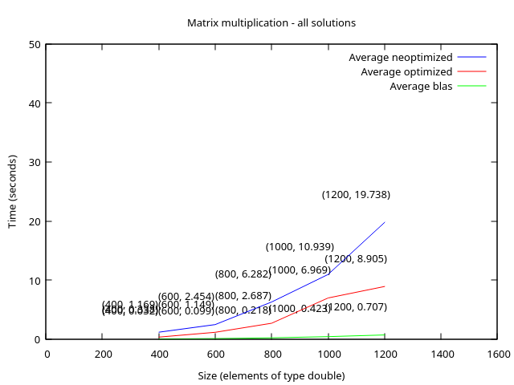

Copyright 2024 Maria Sfiriala (maria.sfiraiala@stud.acs.upb.ro)

# Matrix Multiplication Optimizations - Project3

## Description

The project aims to implement 3 algorithms in order to determine C's values from the following matrix formula:

$C = (A^t×B+B×A)×B^t$,

with $A$ being an upper triungular matrix.

The algorithms should be

1. an inefficient one,

1. a more efficient version of the first one,

1. one that uses highly optimized functions from the BLAS (Basic Linear Algebra Subprograms) library.

### Inefficient Algorithm

The unoptimized version

1. gets the values of the transpose matrices individually, before performing each multiplication.
We keep in mind that $A$ is an upper triungular matrix and we start filling in the transpose only if the values are non-zero (that is, we ignore the values under the leading diagonal).

1. performs the multiplication between $A^t$, a lower triungular matrix, and $B$, such as that, in the k loop, we ignore the values over the leading diagonal, because they are 0 and won't contribute to the final product.

1. performs the multiplication between $B$ and $A$.
Since $A$ is an upper triungular matrix, in the k loop, we ignore the values under the leading diagonal, as they won't affect the overall result.

1. adds the 2 matrices resulted from the previous steps, just as we would add vectors, due to the fact that we store the matrices as arrays for better access time.

1. performs a simple matrix multiplication for the final step as both factors could be very well dense matrices.

### Optimized Algorithm

The optimized version pretty much follows the same steps as the above variant with a few tweaks for faster calculations:

1. We don't determine the transpose matrices beforehand: with smarter index work both $A^t×B$ and $sum×B^t$ can be calculated at once, without the extra `for`s needed for the transpose matrices.

    Exhibit A:

    ```C
    for (int i = 0; i < N; ++i) {
		register double *a_t = &A[i];
		for (int j = 0; j < N; ++j) {
			register double sum = 0.0;

			register double *pa_t = a_t;
			register double *pb = &B[j];

			for (int k = 0; k <= i; ++k) {
				sum += (*pa_t) * (*pb);
				pa_t += N;
				pb += N;
			}
			res[i * N + j] = sum;
		}
	}
    ```

    `pa_t` is incremented by `N`, in order to traverse the first factor by column, rather than by line, since we are multiplying its transpose.

    Exhibit B:

    ```C
	for (int i = 0; i < N; ++i) {
		register double *a = &A[i * N];
		for (int j = 0; j < N; ++j) {
			register double sum = 0.0;

			register double *pa = a;
			register double *pb = &B[j * N];

			for (int k = 0; k < N; ++k) {
				sum += (*pb) * (*pa);
				++pa;
				++pb;
			}
			res[i * N + j] = sum;
		}
	}
    ```

    `pb` is incremented by 1 even though it represents the values of the second factor, which should be traversed by column.
    This is due to the fact that we are multiplying its transpose.

1. We use the `register` keyword in order to indicate that the values should be placed into the processor's registers as opposed to being fetched from memory every single time.

1. We aren't accessing the values stored in matrices using the `[][]` syntax, since the compiler is translating this (at first glance) facil operation, into 4 integer additions and 2 integer multiplications.
As a result we increment and add values to **pointers**, storing each time the previous value and reducing the need to fetch the start address, scale it and so on.

1. Just as in the previous implementation, we beared in mind that $A$ is an upper triungular matrix and, therefore, $A^t$ is a lower triungular matrix and we stopped the inner loops earlier, to avoid multiplying stuff by 0.

### Blas Algorithm

The Blas version uses 4 functions from the library and thus manages to ease the code readability and improve performance even when compared to the "optimized algorithm".

We divided the implementation into 4 steps:

1. Determine the $A^t×B$ part of the equation using `cblas_dcopy()` and `cblas_dtrmm()`.
The first function is used to place $B$ into the result variable, while the second function, transposes $A$, multiplies it by $B$ and stores it back into the variable that contained the $B$ matrix before.
Very convenient! 

1. Determine the $B×A$ part of the equation using `cblas_copy()` and `cblas_dtrmm()`.
The first function is used as before, in order to place $B$ into the result variable (since it is the only matrix that is **not** guaranteed to be triungular), while the second function multiplies it by $A$ and because the order is reversed, we also signal that with `CblasRight`.

1. Sum $A^t×B$ and $B×A$ together using `cblas_daxpy()`.
Even though the function is used with a scaler, by giving it the value 1, we accomplish just what we want.

1. Multiply the sum with $B^t$.
Use the `cblas_dgemm()` which basically performs $C←αAB + βC$, so we set $C$ to be the final result and have $β$ be 0.

## Performance

While the strategy employed in the **optimized version** is not that different from the **stupid version**, it drastically changes compute times:

* the `register` keyword instructs the compiler to place the values inside processor registers and avoid unnecessary memory accesses;

* eliminating the transpose step gets rid off loops that wouldn't have counted to the big `O` complexity but that matter in real life;

* incrementing pointers instead of accessing the matrix values by `[][]` saves time on the ALU.

### Cache

#### Instructions

* Refs

	The **inefficient version** of the algorithm has the most instruction references, something we expected, since we divided the algorithm in multiple for loops (eg: calculating the transpose in advance, even though we didn't really have to).
	The **Blas version** of the algorithm has the lowest number of instructions, and that also makes sense, since it was constructed with performance in mind.

* Miss rate

	All versions have virtually 0% miss rate, meaning that the code is small enough to "not spill over the cache".

#### Data

* Refs

	The **inefficient version** of the algorithm has the most data references, again, to be expected: we hold multiple copies of the data in many matrices, that are moved back in forth the cache.
	Once again, the **Blas version** holds the minimum amount of data references, I suppose due to other optimizations techniques, which weren't approached in the **hand optimized version**, such as BMM and loop unrolling (and maybe the Strassen algorithm).

* Miss rate

	Interestingly enough, the **hand optimized version** holds the title for most miss rates, and that's due to the fact that we jump through matrices a lot when multiplying them while also computing the transpose.bots

#### Branches

Similar number of branches for the the **unoptimized and optimized versions**, since the loops (and therefore the ifs) are virtually the same.

### Graphs

Let's take into consideration the graph that contains information about all versions of the algorithm:



We can conclude that:

* execution time is directly influenced by the size of the matrices,

* all algorithms follow more or less the same slope ("pantă??"), with the most consistent one being attached to the Blas implementation.

### Observations Regarding The Project

Fun, little project.
I hated writing the documentation though, and I usually love doing that.
Must be the end of the semester taking a toll on me.

Also, please, next time, have the cluster and Moodle checker functional all the time!
And maybe less crowded by the people training AI models and doing research work (:
